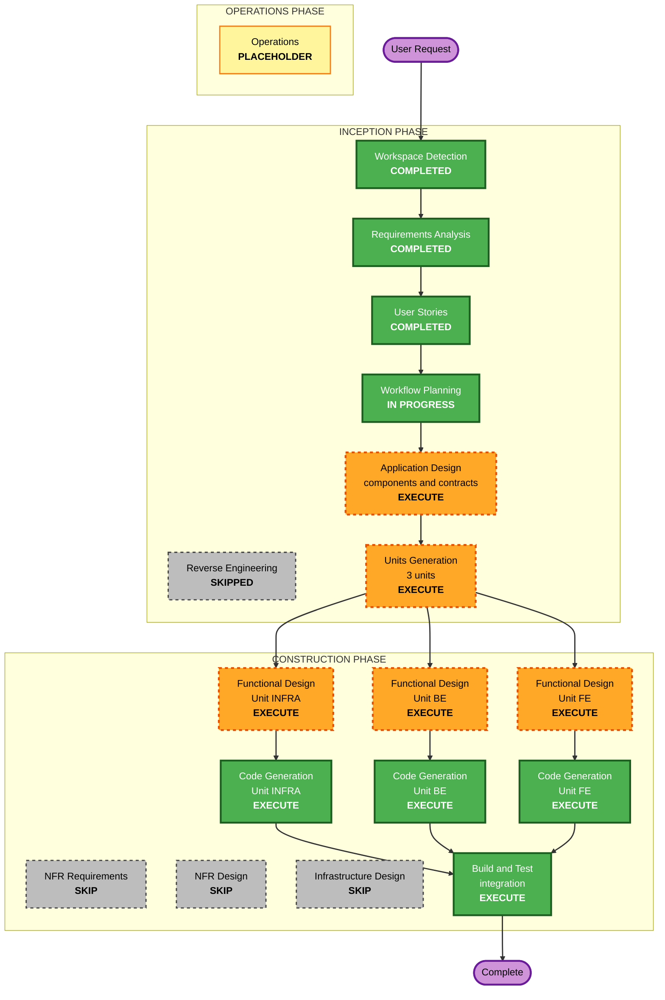

# Execution Plan

**Stage**: INCEPTION - Workflow Planning
**Created**: 2026-08-20T03:31:18Z
**Revised**: 2026-08-20T03:42:55Z - revision 2, restructured for a 3-person parallel team (Infra / BE / FE)
**Project**: prompthon - AI-characterized companion layer over LG products
**Inputs**: `requirements.md` (rev 4), `stories.md` (rev 4), `personas.md`, `user-stories-assessment.md`

---

## 0. Revision 2: what changed and why

The original plan assumed **one builder working sequentially**, and split work into two units by feature: Foundation, then Discovery. With **three people working in parallel across Infra, BE, and FE**, that structure is wrong in a specific way: it produces two sequential checkpoints where three people would spend most of their time waiting on each other.

The constraint also moves. With one builder the binding constraint was total hours. With three builders the wall clock is unchanged at 1.5 days but capacity roughly triples to ~36 person-hours, and the new binding constraint becomes **interface contracts and integration**. Three people can only work in parallel to the extent that they agree in advance on what passes between them. Time spent on contracts before the split is not overhead; it is what buys the parallelism.

Consequently:

| Decision | Before | Now | Reason |
|---|---|---|---|
| Application Design | SKIP | **EXECUTE** | Now the stage that fixes component boundaries and interface contracts. Also a hard prerequisite of Units Generation |
| Unit split | 2 units by feature | **3 units by component** | Aligns with the three separable interfaces, which is what allows parallel work |
| Functional Design | 2 iterations | **3 iterations, run in parallel** | One per unit, each owner designs their own |
| Code Generation | 2 sequential passes | **3 parallel passes** | One per unit |
| Critical risk | Discovery pillar working at all | **Integration at the seams** | Three independently built components meeting for the first time is now the most likely failure |

### An honest note on the unit split

The workspace YAGNI rules contain a direct warning against what this looks like: *do not split units for org-chart reasons ("we have 3 people so let's make 3 units")*. That warning is correct and worth taking seriously, so here is why this split is being recommended anyway rather than quietly ignoring the rule.

The same rule permits splitting where **clearly separable interfaces** exist. Two real interfaces exist here independently of how many people are on the team:

1. The **device API**, already required by FR-5.1 and FR-5.7 as a genuine request boundary, with FR-5.5 requiring that stats be read from a path the agent cannot write to.
2. The **application API** between browser and server, unavoidable because NFR-1.2 forbids model credentials reaching the browser.

Those two boundaries partition the system into three components on their own. The team happening to have three people is a convenience, not the justification. Had the team been one person, the same three components would exist - they would simply be built in sequence.

**The cost of this split is real and is recorded here rather than discovered later**: story coverage becomes cross-cutting. Almost every story touches two or three units, so `unit-of-work-story-map.md` will map stories to a primary unit plus contributing units rather than cleanly one-to-one. That is the price of layer-shaped units, and it concentrates risk at integration. Section 6 exists to manage it.

---

## 1. Detailed Analysis Summary

### 1.1 Transformation scope

Not applicable. Greenfield, no existing code.

### 1.2 Change impact assessment

| Impact area | Applies | Detail |
|---|---|---|
| **User-facing changes** | Yes | Entire deliverable. 9 stories, 2 personas, 5 epics |
| **Structural changes** | Yes | Strict 1:1:1 agent-character-device binding, three agents, device API boundary, asymmetric read/write paths |
| **Data model changes** | Yes | Skill composition with trigger, provenance and revisions; progression counters; device state; feedback log; tiered fixture |
| **API changes** | Yes | Two contracts: device API, and the application API between browser and server |
| **NFR impact** | Yes | 10 lite NFRs fixed in `requirements.md`. Both AWS baselines deliberately disabled |
| **Team coordination** | Yes | **New in revision 2.** Three parallel owners, two shared contracts, integration at the seams |

### 1.3 Risk assessment

- **Risk Level: High** *(raised from Medium-High in revision 1)*
- **Rollback Complexity: Easy** - greenfield, nothing in production
- **Testing Complexity: Moderate-High** - the deterministic fixture makes discovery testable, but three-component integration adds a class of failure that did not exist in the single-builder plan

Risk drivers, ordered by how likely each is to hurt:

1. **Integration at the seams.** *New and now the top risk.* Three components built in parallel against agreed contracts still meet for the first time late in the day. If a contract was misread, the discovery happens with hours left, not days.
2. **1.5 days wall clock.** Unchanged by adding people. Three people do not make the day longer, and coordination consumes some of the gain.
3. **The primary pillar depends on generative behaviour.** Autonomous discovery is both the deep pillar and the least predictable component. NFR-4.1's determinism requirement contains this but does not remove it.
4. **BE load - RESOLVED.** Revision 3 left BE with 12+ hours of work in a 12 hour window while INFRA had 2-3. The two-phase INFRA role decided in section 4 rebalances this to roughly 9 / 8-9 / 8-9 across BE, INFRA and FE. The residual risk is now the **hour-4 handoff itself**: the device stub interface must be settled during Functional Design rather than evolved while coding, or the handoff stalls both people.
5. **Transcribe streaming is the most fragile element.** Browser capture plus server-side streaming, 1-3 hours. Now split across FE and BE, which makes it a seam as well as a task.
6. **The fixture is load-bearing.** Per FR-6.3 discovery can only surface patterns the seeded data contains.

---

## 2. Workflow Visualization



### Text alternative

```
INCEPTION PHASE
  Workspace Detection ......... COMPLETED
  Reverse Engineering ......... SKIPPED   (greenfield)
  Requirements Analysis ....... COMPLETED (approved, merged via PR #4)
  User Stories ................ COMPLETED (9 stories, 2 personas, rev 4)
  Workflow Planning ........... IN PROGRESS
  Application Design .......... EXECUTE   (3 components, 2 contracts)  <-- changed
  Units Generation ............ EXECUTE   (3 units)                    <-- changed

CONSTRUCTION PHASE  (three parallel streams)
  NFR Requirements ............ SKIP
  NFR Design .................. SKIP
  Infrastructure Design ....... SKIP

  ---- joint, before the split ----
  Application Design + Units Generation: contracts frozen

  ---- parallel from here ----
  Stream INFRA : Functional Design -> Code Generation
  Stream BE    : Functional Design -> Code Generation
  Stream FE    : Functional Design -> Code Generation

  ---- rejoin ----
  Build and Test .............. EXECUTE   (integration is the real work here)

OPERATIONS PHASE
  Operations .................. PLACEHOLDER
```

---

## 3. Phases to Execute

### INCEPTION PHASE

- [x] Workspace Detection - **COMPLETED**
- [x] Reverse Engineering - **SKIPPED** - greenfield, nothing to analyse
- [x] Requirements Analysis - **COMPLETED** - approved, merged via PR #4, revised four times since
- [x] User Stories - **COMPLETED** - 9 stories, 2 personas, four revisions
- [x] Workflow Planning - **IN PROGRESS**
- [ ] Application Design - **EXECUTE** *(changed from SKIP in revision 1)*
  - **Rationale**: Two independent reasons, either sufficient. First, `units-generation.md` lists Application Design as a **required prerequisite** of Units Generation, so executing units without it is not available. Second, and more substantively, this is now the stage that produces the artifact the parallelism depends on: component boundaries and the two interface contracts. With three people about to work simultaneously, a wrong or vague contract is the most expensive mistake on the table, and it is cheapest to prevent here.
  - **Scope discipline**: capped at **3 top-level components**. The YAGNI guidance asks for an explicit flag above 3-4 components for an MVP; three is the floor the two mandated interfaces already impose, so no further decomposition is permitted. No separate services for discovery, progression, or skill storage - those are modules inside BE.
- [ ] Units Generation - **EXECUTE**
  - **Rationale**: Produces the three unit definitions, the dependency matrix, and the story map. The dependency matrix matters more than usual here: it is what tells each owner what they may assume and what they must stub.

### CONSTRUCTION PHASE

Runs as **three parallel streams**, not a sequential loop.

- [ ] Functional Design - **EXECUTE**, three times, in parallel
  - **Rationale**: Retained by the user's Round 2 Q6 = B decision and now additionally load-bearing: each owner designs against the frozen contracts, so each design can proceed without waiting. The BE design carries the heaviest content - skill representation, trigger vocabulary, provenance, revision semantics, graph state shape - plus the four decisions deferred from `requirements.md`.
- [ ] NFR Requirements - **SKIP**
  - **Rationale**: Nothing left to determine. The 10 lite NFRs are fixed and numbered, both baselines disabled, stack settled.
- [ ] NFR Design - **SKIP**
  - **Rationale**: Conditional on a skipped stage. The NFRs in scope are a timeout, a retry, a fallback message and an input cap - none needs a design pass.
- [ ] Infrastructure Design - **SKIP**
  - **Rationale**: Worth pausing on, since there is now a person named Infra. The stage is still skipped: the committed build runs locally, deployment is conditional on time remaining, and NFR-5.2 already states the only requirement that applies if it happens. The Infra **stream** has substantial work - AWS resources, the device API service, fixture generation - but that work is unit-level design and code, not a separate infrastructure design stage for a deployment that may not occur.
- [ ] Code Generation - **EXECUTE**, three times, in parallel
- [ ] Build and Test - **EXECUTE**, once, after all three streams
  - **Rationale**: This is where the plan's top risk lands. Integration between the three units is the substance of this stage, not a formality appended to it.

### OPERATIONS PHASE

- [ ] Operations - **PLACEHOLDER**

---

## 4. The Three Units

Confirmed properly during Application Design and Units Generation. Recorded here as the basis for those stages.

*Revised 2026-08-20T03:52:10Z (revision 3): the device API becomes a stub owned by BE, and INFRA narrows to IaC and environment setup for AWS services only.*

### Unit INFRA - IaC and environment only

**Owns**
- Infrastructure as code for all AWS resources
- DynamoDB tables, keys, and access patterns provisioned
- Bedrock access and model enablement
- Transcribe access
- IAM roles, policies, credential wiring
- Environment configuration: `.env` shape, local dev orchestration, run scripts
- Conditional EC2 deployment if time allows
- **Added in revision 3**: the integration harness and demo environment readiness - the thing that makes checkpoints 1 and 2 executable rather than aspirational

**Publishes**: the DynamoDB schema, environment contract
**Consumes**: nothing. **Starts immediately, blocks on no one.**
**Owns zero user stories.** This is an enabling unit, not a story-bearing one - see the note below.

### Unit BE - agents, discovery, and the device stub

**Owns**
- **Device API stub** *(moved here in revision 3)*. Still exposed behind an HTTP route so that stats have a structured, non-model-authored origin per FR-5.5, but implemented as a stub rather than a simulated appliance service
- Runtime state passed through to the UI via the agent, synchronous, not persisted *(revision 4)*
- In-memory usage-event buffer, flush, persist, clear cycle (FR-5.6) - **for Skill Discovery accumulation, not for the display** *(revision 4)*
- Capability enumeration endpoint - the vocabulary skill generation composes over (FR-5.3)
- Three agents, strict 1:1:1 binding (FR-5.4), LangGraph with `createAgent` and middleware
- Agentic Control: tools per product, prompting, per-product state
- **Discovery engine**: usage analysis, tiered basic and advanced skills, provenance
- Skill representation as composition over the enumerated vocabulary, bounded so generated skills are executable by construction (FR-3.4)
- Skill lifecycle: announcement payloads, invocation, feedback-driven revision and retirement
- Server-side Transcribe streaming endpoint
- Application API serving FE
- **Tiered usage fixture** *(moved here in revision 3)*: 14-day and 60-day tiers per product with the deliberate latent patterns FR-6.3 requires. Domain work, so it follows discovery rather than infrastructure. See the definition below

#### What "fixture" means here

Not test fixtures in the unit-testing sense. This is **pre-authored synthetic usage history** - the seed data the discovery engine reads in order to find patterns. Roughly a few hundred records per product, committed to the repository, of the shape:

```json
{
  "deviceId": "shoecase-01",
  "event": "dry_completed",
  "at": "2026-06-03T21:40:00+09:00",
  "params": { "durationMin": 30, "mode": "sneaker" }
}
```

Three products, two tiers each: 14 days sufficient for a basic skill, 60 days for an advanced one.

**FR-6.3 is what makes this load-bearing rather than filler.** Autonomous discovery can only surface patterns that exist in the data. Generated as uniform random usage, the agent will correctly find nothing and the primary pillar will produce no visible result on stage. The patterns therefore have to be **deliberately authored in** - for example weekday-evening sneaker drying clustered around 21:00, Pra.L sessions concentrated on Tuesdays and Thursdays, Massage Chair use spiking shortly after those same evenings. The agent finds these unaided; the requirement is only that they be there to find.

**Why this is separable from the discovery engine**: it needs no LangGraph and no agent knowledge. It is data design plus a generator script. But because it determines discovery quality, having one person build both the fixture and the engine that reads it is a poor division of attention.

**Publishes**: the application API contract
**Consumes**: the DynamoDB schema, environment contract

### Unit FE - browser application

**Owns**
- Mobile-first responsive web application
- Roster and per-character screen
- **Character stats as the device UI** - no device panel anywhere (FR-1.4, FR-5.5)
- Chat: text input, streamed replies, unprompted announcements
- Skill list including tier and provenance display
- **Progression presentation**: level-up effect triggered by discovery, cosmetic evolution. Progression was scoped as presentation-led, so most of it lives here rather than in BE
- Browser audio capture feeding the Transcribe path
- Korean default with English toggle

**Publishes**: nothing
**Consumes**: the application API contract
**Stubs while waiting**: a fixture-backed mock of the application API. **This is not optional.** Without it FE is blocked behind BE for most of the day, which would waste roughly a third of the team's capacity.

### Load balance: the problem, and the decision that resolves it

Revision 3 moved two significant pieces of work **into** BE (device API stub, fixture authoring) and removed BE's only external dependency. It simultaneously narrowed INFRA to IaC and environment. The consequence needs stating plainly rather than being buried:

| Unit | Rough effort in a 12 hour window | Story ownership |
|---|---|---|
| INFRA | **2-3 h** of genuine work | None |
| BE | **12+ h** of genuine work | 6 of 9 stories |
| FE | **8-9 h** of genuine work | 4 of 9 stories |

**BE is now over capacity for one person and INFRA is at roughly a quarter.** IaC for a few DynamoDB tables, Bedrock and Transcribe access, IAM, and environment scripts is real and necessary work, but it is not a day of it. Meanwhile BE owns the device stub, three agents, all of Agentic Control, the entire discovery engine, the skill lifecycle, the Transcribe endpoint, the application API, and now the fixture too. Left as-is, the deep pillar - the thing the demo exists to show - is the work most likely to be unfinished, while a third of the team runs out of things to do around hour 4.

### SUPERSEDED 2026-08-20T06:52:14Z: the two-phase INFRA role no longer applies

Option A was decided at 04:18 and gave INFRA the device stub and the fixture from hour 4, which rebalanced INFRA from 2-3 hours to 8-9. **Both of those items have since left the phase**, so the decision's premise is gone:

- **The device stub is now a canned-response server**, not a simulator. No state machine, no clock, no event emission. It is roughly an hour of work rather than several.
- **The fixture has left this phase entirely.** It is no longer INFRA's deliverable and moves to product development.

What remains true from that decision: INFRA's phase 1, hours 0 to 4, is IaC and environment, is not interruptible, and unblocks the other two streams.

### Consequence: the load imbalance narrows, but BE stays heaviest

| Unit | Effort in this phase |
|---|---|
| INFRA | **~3 h** - IaC, environment, integration harness |
| BE | **~8-9 h** - canned stub with generic raw events, three agents, control, app API, **the discovery pipeline**, Transcribe endpoint |
| FE | **~8-9 h** - unchanged |

**Skill Discovery over raw device data remains this phase's core deliverable**, so BE's largest piece of work did not shrink. What left BE's plate is the *simulator* - clock, timers, lifecycle events - and product-authentic data authoring. The discovery pipeline itself is unchanged: EXAONE reasoning, pattern finding, synthesis, validation against the capability vocabulary, persistence, announcement.

What actually changed is that **INFRA got smaller**, since the canned stub is roughly an hour and the product-authentic fixture left the phase.

**Open decision** on the resulting INFRA slack:

- **A)** INFRA finishes IaC at hour 4 and joins whichever stream is behind, likely FE.
- **B)** INFRA absorbs the canned device stub from BE at hour 2, then joins FE. Buys BE an extra hour on discovery.
- **C)** Accept INFRA idling after hour 4.

### Success criteria are unchanged

*Corrected 2026-08-20T07:02:38Z. An earlier draft of this section claimed the phase could no longer demonstrate autonomous discovery and proposed rewriting section 7. That was wrong and is withdrawn.*

Deferring the *product-authentic* fixture does not remove usage data. The canned stub supplies generic raw usage events, and generic raw events are sufficient for discovery to find patterns, synthesise skills, validate them, persist them and announce them. Section 7 stands as written: this phase still ends with a character inventing a skill unasked, explaining why, and changing it on feedback.

What will look different from the eventual product is only **how convincing the discovered skill is**, because the patterns it finds are generic rather than product-realistic. The pipeline that finds them is the same one.

### A note on INFRA owning no stories

`unit-of-work-story-map.md` requires every story to be assigned to a unit. INFRA will legitimately map to none of the nine, because IaC produces no user-visible behaviour. It is an **enabling unit**: every story depends on it and none belongs to it. This is recorded now so that the story map does not look broken during Units Generation, and so nobody tries to invent a story like "as an owner I want DynamoDB tables" to fill the gap.

---

## 5. Contracts

The parallelism rests entirely on these. They are frozen during Application Design, before any stream starts.

**Revision 3 reduced the cross-team contracts from three to two, which is genuinely good news for the top risk.** With the device API now a BE-owned stub, its contract stops being a seam between two people and becomes internal to one. Fewer seams, less integration risk.

| # | Contract | Between | Must specify |
|---|---|---|---|
| 1 | **DynamoDB schema** | INFRA to BE | *Revised in revision 4.* **Primary**: accumulated usage events for Skill Discovery. **Secondary**: character progression, skills with provenance and revisions, feedback log. **No longer includes current device state**, which is runtime-only |
| 2 | **Application API** | BE to FE | Chat send and reply, unprompted announcement delivery, stats read, skill list including tier and provenance, skill invocation, feedback submission, audio upload for Transcribe |
| 3 | **Shared types** | all three | Character, device state, skill, level, provenance. One definition, not three |
| 4 | **Environment contract** | INFRA to BE and FE | `.env` shape, resource names, endpoints, how to run locally |
| - | *Device API* | *internal to BE* | Still documented and still behind an HTTP route, because FR-5.7's asymmetric path boundary and FR-5.5's guarantee depend on it existing. No longer a cross-team seam |

**One caution created by this change.** *Rewritten twice: 2026-08-20T04:02:33Z to correct a misstatement, then 2026-08-20T04:11:47Z after runtime state was removed from DynamoDB.*

What FR-5.5 restricts, stated carefully because it is easy to overstate. The agent **may** read device state - it needs it to answer "지금 건조 중이야?" - and the agent **may** change it by issuing commands. The single forbidden thing is that **displayed stats be composed from model-generated text**. Stats must arrive as a structured device API response that the agent passes through rather than authors.

The invariant lives in **payload provenance**, not in the storage path. Two earlier revisions of this plan put it in storage - first "read from the device API", then "read from DynamoDB" - and both were looking in the wrong place. A model can write a convincing sentence; it cannot fabricate a structured device response. That is what does the work, and it is indifferent to where the value is stored afterwards.

**Residual risk with BE owning both sides**: under time pressure someone can have the agent construct the stats payload itself from what it believes it just did, rather than forwarding what the device returned. The screen would then show intent rather than fact, and the failure is invisible in the happy path because intent and fact usually agree.

**Observable test for Build and Test**: make the device clamp a request - accept "30 minutes" but return 25 - and confirm the UI shows **25**. A model-composed payload will say 30, because 30 is what the conversation was about. This test is cheap, unambiguous, and worth running deliberately in front of judges as a five-second proof that the character is wired to the product rather than narrating over it.

Rules that make this work in practice:

1. **Contracts freeze before streams start.** Changing one mid-flight requires telling both sides, not one.
2. **Both consumers stub against contracts immediately.** BE fakes the device API, FE mocks the application API. Nobody waits.
3. **Shared types live in one place** and are imported, not retyped. Three hand-maintained copies of a skill shape will diverge within hours.
4. **Contract changes are announced, never assumed.** This is the failure mode that costs the most and is hardest to detect.

---

## 6. Schedule and Integration Checkpoints

1.5 days wall clock, roughly 12 hours, three people, roughly 36 person-hours.

Reflects the two-phase INFRA role, decided 2026-08-20T04:18:29Z.

| Window | INFRA | BE | FE | Gate |
|---|---|---|---|---|
| 0.0-1.5 h | *joint session, all three* | Application Design and Units Generation | *joint session, all three* | **Contracts frozen** |
| 1.5-2.5 h | Functional Design | Functional Design | Functional Design | Parallel, each against frozen contracts |
| 2.5-4.0 h | **IaC**: DynamoDB tables, Bedrock and Transcribe access, IAM, env scripts | Device stub behind its route, agents, control tools, app API skeleton | UI shell, roster, character screen against the mock | INFRA unblocks both streams here |
| 4.0 h | - | - | - | **Handoff**: INFRA takes the device stub and fixture from BE |
| 4.0-5.5 h | Device stub completion, fixture authoring with latent patterns | **Discovery engine begins**, uninterrupted | Chat, stats rendering from the read path | |
| 5.5-6.0 h | *all three together* | *all three together* | *all three together* | **Integration checkpoint 1**: FE against real BE, BE against the real stub route, reads coming from DynamoDB. Contract mismatches surface here, with 6 hours left |
| 6.0-9.0 h | Fixture patterns, flush tuning, integration harness, deployment if time | **Discovery engine, skill lifecycle, Transcribe endpoint** | Skill list, level-up effect, cosmetic evolution, audio capture | |
| 9.0-10.0 h | *all three together* | *all three together* | *all three together* | **Integration checkpoint 2**: full demo path end to end |
| 10.0-11.5 h | Build and Test | Build and Test | Build and Test | Joint. Rehearse the run-of-show from US-5.1 |
| 11.5-12.0 h | Buffer | Buffer | Buffer | |

**Integration checkpoint 1 at the 5.5 hour mark is the most important line in this plan.** The default failure mode for three parallel streams on a short clock is integrating at hour 10 and discovering a contract was misread. Forcing a thin end-to-end connection at 5.5 hours costs half an hour and converts a potential disaster into a normal bug.

**Drop order if time runs short**, unchanged from revision 1 and still decided in advance rather than under pressure: **voice input first, then cosmetic evolution, then the English toggle.** All three are visible enough that dropping them silently would be noticed. Voice is also the only item spanning two streams, so dropping it recovers time from both FE and BE.

---

## 7. Success Criteria

### Primary goal

A judge watches a character invent a skill from accumulated usage without being asked, hears why it did so, corrects it in one sentence, and sees the skill change.

### Key deliverables

- Three products, each with its own agent and character in strict 1:1:1 binding
- Natural-language control, with device state shown as character stats read from the committed path rather than the agent's claim
- Autonomous tiered skill discovery with provenance, from a deterministic fixture
- Unprompted announcement, level-up presentation, feedback-driven revision
- Mobile-first browser UI, Korean by default

### Quality gates

- Every acceptance criterion in `stories.md` demonstrable
- Discovery deterministic given the same fixture and feedback state (NFR-4.1)
- No generated skill references a capability that does not exist (FR-3.4)
- Stats never derived from agent reply text (FR-5.5)
- A model call failure degrades visibly rather than blanking the screen (NFR-2.2)
- Property-based tests on pure functions and serialization round-trips (NFR-3.1)
- All 10 lite NFRs satisfied
- **New in revision 2**: both integration checkpoints passed on schedule, and no unit merged with a hand-copied duplicate of a shared type
