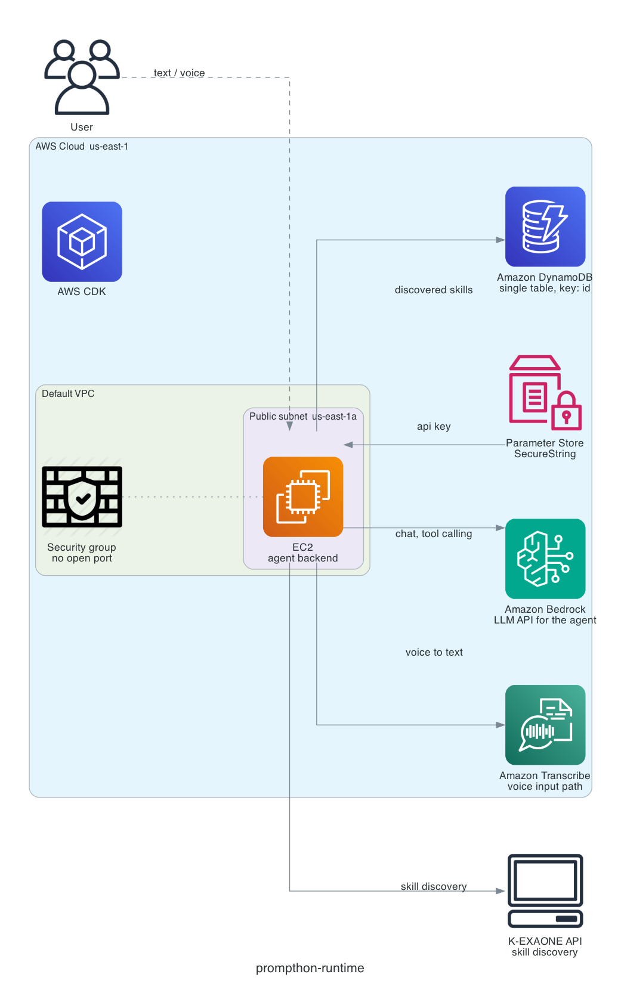

# prompthon infrastructure

Stack `prompthon-runtime`, account `643922457910`, `us-east-1`. Deployed and
verified 2026-08-20.

Regenerate with `infra/diagram.py` after changing the stack.

## Notes on the diagram

- **The security group has no open port, and the user arrow is dashed for that
  reason.** Two separate cases. *Admin access* needs no port at all, permanently:
  SSM Session Manager works by the instance dialling out, so there is no SSH port to
  scan and no key pair to lose. *Application ingress* is a port we will eventually
  open, but not yet — the app does not exist, and NFR-5.2 requires the shared
  passcode gate before public exposure. Opening it now would just leave an
  unauthenticated host on the internet for days. One rule gets added at deploy time.
- **Two LLMs, split by role.** Bedrock serves the agent's interactive chat and tool
  calling. K-EXAONE runs skill discovery in the background, off the request path,
  and is the only side that sees accumulated usage history.
- **Voice and text are one input surface.** Text goes straight to the backend; voice
  goes through Transcribe first, so the agent only ever receives text.
- **One DynamoDB table, partition key `id` alone, no sort key, no index.** The schema
  is taken from `packages/backend/src/data/skills.ts`, which addresses items by `id`.
  The name is CloudFormation-generated on purpose: a custom-named table cannot be
  replaced, so a fixed name would block any future key change. It reaches BE as
  `DDB_TABLE_NAME`. Only skills are persisted today — usage events and app context
  are in-memory by BE's deferral — and everything else fits this same table by id
  prefix if it moves later.
- **K-EXAONE is outside AWS**, so outbound egress is its only path. Its key comes
  from Parameter Store, never from a file on the host.

## Instance role permissions

| Purpose | Actions | Resource |
|---|---|---|
| Management | `AmazonSSMManagedInstanceCore` | AWS managed policy |
| Friendli key | `ssm:GetParameter` | One exact parameter ARN. No list, no path read, no write |
| Bedrock | `InvokeModel`, `InvokeModelWithResponseStream` | `foundation-model/*`, `inference-profile/*` |
| Transcribe | `StartStreamTranscription` | `*` — no resource-level permission exists |
| DynamoDB | read and write item operations | The app table ARN only |

The Bedrock region wildcard is required: `us.` inference profiles fan out to sibling
regions and fail without foundation-model permission there. `Converse` needs no
separate grant since it depends on Invoke.

Deployment evidence and the in-instance verification runs are in
`aidlc-docs/construction/infra/code/deployment-evidence.md`. Setup prerequisites are
in `README.md`.
